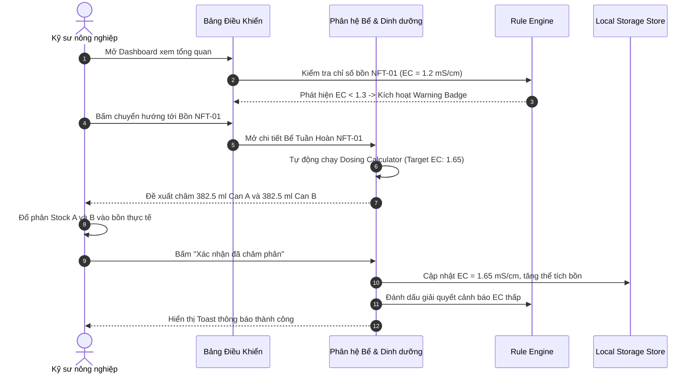
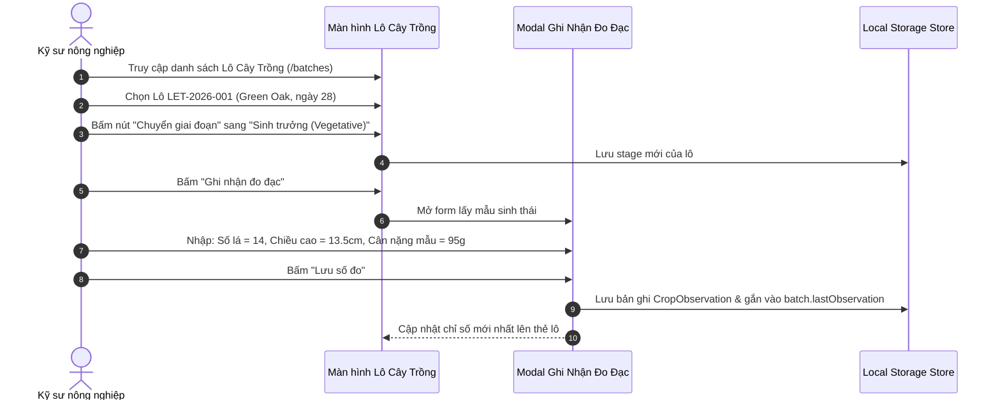
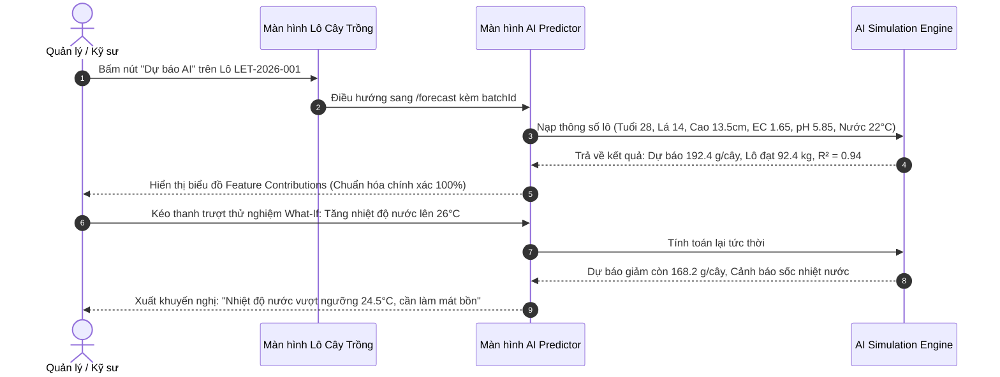
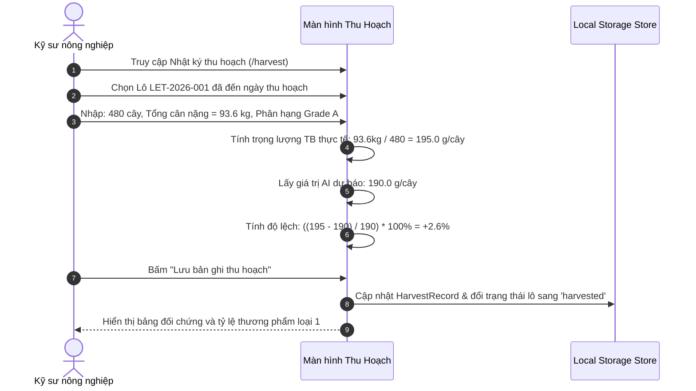

# HydroSmart — Hệ Thống Quản Lý Thủy Canh Thông Minh & AI Dự Báo Năng Suất FRS

## Metadata

- **Tên dự án**: HydroSmart — Smart Hydroponic Farm Management System with AI Yield Prediction
- **Mã tài liệu**: `HYDROSMART-FRS-v1.0`
- **Phiên bản**: v1.0
- **Trạng thái**: Draft (Chờ Engineer Review & Approve)
- **Source request**: `Đọc kĩ dự án sau đó soạn cho tôi tài liệu FRS bằng tiếng Việt, template như docs, bám sát prompt AGENTS.md`
- **Bước quy trình**: B1 — Làm rõ requirement (theo quy trình 10 bước chuẩn hóa trong `NOTE QUY TRÌNH AI AGENT CODE` & `AGENTS.md`)
- **Đối tượng áp dụng**: Trang trại thủy canh hồi lưu NFT (*Nutrient Film Technique*) chuyên canh các giống xà lách thương phẩm (*Lactuca sativa*).

---

## Objective

Xây dựng hệ thống phần mềm quản lý trang trại thủy canh thông minh **HydroSmart** đóng vai trò là **Hệ Thống Hỗ Trợ Quyết Định (Decision Support System - DSS)** toàn diện cho kỹ sư nông nghiệp và người quản lý trang trại, bao gồm các mục tiêu cốt lõi:

1. **Số hóa toàn diện chu trình nông học khép kín 7 phần**:
   ```text
   [1] Cây trồng ──► [2] Hệ thống NFT ──► [3] Nước ──► [4] Dinh dưỡng Stock A/B ──► [5] Môi trường ──► [6] Sinh trưởng & Thu hoạch ──► [7] AI & Cảnh báo
   ```
2. **Quản lý bồn tuần hoàn NFT & Dinh dưỡng đa - vi lượng chính xác**:
   - Giám sát 3 chỉ số lý hóa thiết yếu: pH, độ dẫn điện EC (mS/cm), nhiệt độ nước (°C).
   - Quản lý công thức dinh dưỡng tiêu chuẩn khoa học (Resh, Hoagland, Sonneveld) với cơ chế tách biệt bắt buộc **Can Stock A** và **Can Stock B** nhằm triệt tiêu hiện tượng kết tủa muối khoáng (CaSO₄ và Ca₃(PO₄)₂).
   - Cung cấp công cụ tính toán liều lượng châm phân bù EC tự động và công thức pha 10L mẹ tại kho.
3. **Quản lý vòng đời lô cây trồng (`CropBatch`) & Dữ liệu sinh trắc học**:
   - Theo dõi từng lô qua 4 giai đoạn sinh trưởng (`seedling` → `vegetative` → `pre_harvest` → `harvest`).
   - Ghi nhận nhật ký đo đạc sinh thái (`CropObservation`: số lá thật, chiều cao, trọng lượng mẫu) làm ground-truth cho AI.
4. **Mô hình AI dự báo năng suất sinh khối (AI Yield Prediction)**:
   - Tích hợp mô phỏng nông học chuẩn hóa dựa trên các nghiên cứu thực nghiệm (Frontiers in Plant Science 2022 & Mendeley Hydroponic Dataset).
   - Dự báo trọng lượng tươi (g/cây) tại thời điểm thu hoạch và tổng sản lượng cả lô (kg/lô).
   - Phân tích mức độ đóng góp đặc trưng (Feature Contributions) chuẩn hóa 100% và cung cấp bộ thử nghiệm kịch bản What-If đa biến.
5. **Hệ luật cảnh báo tức thì (Rule Engine) & SOP xử lý**:
   - Phát hiện các rủi ro tụt/tăng EC, lệch pH, sốc nhiệt nước bồn với cơ chế chống lặp cảnh báo (Alert Deduplication).
   - Hướng dẫn quy trình vận hành chuẩn (SOP) từng bước cho kỹ sư trang trại.
6. **Đối chiếu thu hoạch & Đánh giá sai số thực nghiệm**:
   - So sánh sản lượng thực tế với dự báo AI để tính độ lệch Δ%.
   - Phân loại chất lượng thương phẩm (Grade A, B, C) phục vụ bài toán tối ưu hóa kinh tế.

---

## Requirement Review / Challenges

Dựa trên nguyên tắc **Think Before Coding** và quy định phản biện bắt buộc trong `AGENTS.md`, AI Agent thực hiện rà soát và phản biện các yêu cầu kỹ thuật - nông học của dự án:

### 1. Điểm hợp lý
- **Lựa chọn mô hình NFT tuần hoàn và chuyên canh rau xà lách (*Lactuca sativa*)**: Hoàn toàn thực tế và khả thi cao. Xà lách có chu kỳ ngắn (35–42 ngày), rễ phát triển tốt trong màng mỏng dinh dưỡng, dễ đo lường sinh khối và sở hữu nhiều dataset quốc tế công khai chất lượng cao (Mendeley >390.000 records, USDA Ag Data Commons, Frontiers 2022).
- **Tách bạch dứt khoát giữa Rule Engine và Machine Learning**:
  - Rule Engine chịu trách nhiệm bắt các sự kiện vượt ngưỡng vật lý tức thời (ví dụ: pH < 5.5 hay EC < 1.3 mS/cm). Đây là phản xạ bắt buộc, có tính tất định (deterministic), không cần dùng mô hình đen (black-box).
  - Machine Learning đảm nhiệm bài toán phức tạp đa chiều: Dự báo tích lũy sinh khối (g/cây) dựa trên tương quan giữa ngày tuổi, số lá thật, chiều cao và lịch sử phơi nhiễm lý hóa.
- **Tách riêng Can mẹ Stock A và Stock B**: Tuân thủ tuyệt đối quy luật hóa học vô cơ thực vật, ngăn chặn muối Canxi kết tủa với Sunfat và Phốt phát gây tắc nghẽn vòi tưới và mất dưỡng chất.
- **Quản lý theo Đơn vị Lô (`CropBatch`)**: Hợp lý về mặt quản trị nông trại thương mại, tránh việc theo dõi vi mô từng cây gây quá tải hệ thống.

### 2. Điểm chưa rõ / Cần làm rõ
- **Giao thức thu thập dữ liệu cảm biến**: Hiện tại hệ thống đang hỗ trợ ghi nhận thủ công (`manual`) kết hợp mô phỏng cảm biến (`sensor`). Cần xác định ở giai đoạn tích hợp phần cứng: Tần suất gửi gói tin đo lường là bao nhiêu phút/lần (ví dụ: 5 phút/lần hay 15 phút/lần) và qua giao thức nào (MQTT qua broker EMQX/Mosquitto hay HTTP REST)?
- **Cơ chế phân biệt giữa cạn nước do thoát hơi và suy kiệt dinh dưỡng**: Cây xà lách vào ngày nắng nóng hút nước nhanh hơn hút khoáng, khiến thể tích bồn giảm và nồng độ EC tăng ảo. Cần có quy trình chuẩn: Kiểm tra và châm bù nước sạch về thể tích danh định trước khi đo EC để quyết định châm phân.
- **Dataset chính thức khi huấn luyện Offline**: Dự án cần chốt cụ thể dataset sẽ dùng để huấn luyện mô hình Machine Learning (Frontiers 2022 dataset hay Mendeley Batavia dataset) để đồng nhất định dạng feature đầu vào.

### 3. Điểm chưa hợp lý / Cần cân nhắc (Phản biện Khoa Học Nông Học)
- ⚠️ **Phản biện 1 — Không đồng nhất EC với từng ion cụ thể**: Nghiêm cấm mọi suy diễn dạng *"EC tụt 0.3 nghĩa là thiếu đạm Nitrogen"*. EC chỉ đo tổng độ dẫn của tất cả các cation (Ca²⁺, K⁺, Mg²⁺, NH₄⁺) và anion (NO₃⁻, H₂PO₄⁻, SO₄²⁻). Khi EC tụt, giải pháp chuẩn là châm đồng thời cả Stock A và Stock B theo tỷ lệ cân bằng, trừ khi có kết quả phân tích phòng thí nghiệm chuyên biệt.
- ⚠️ **Phản biện 2 — Tránh áp đặt một ngưỡng pH/EC cứng nhắc cho toàn bộ trang trại**: Cây xà lách con (Seedling) chỉ chịu được EC từ 0.8 – 1.2 mS/cm, trong khi giai đoạn phát triển sinh khối mạnh (Vegetative) cần 1.5 – 1.85 mS/cm. Hệ thống phải tự động điều chỉnh dải ngưỡng kiểm tra dựa trên giai đoạn sinh trưởng của lô cây đang liên kết với bồn chứa đó.
- ⚠️ **Phản biện 3 — Không gọi cảnh báo điều kiện môi trường là "AI Dự báo bệnh"**: Nếu dataset lịch sử không có nhãn bệnh học cây trồng (ground-truth disease labels), hệ thống chỉ được phép định danh chức năng là **Cảnh báo nguy cơ vi khí hậu (Condition Risk Warning)**. Ví dụ: Nước > 24.5°C làm tăng rủi ro nấm rễ *Pythium*, không được khẳng định là "Cây đã bị nhiễm bệnh".

### 4. Rủi ro chính
- **Rủi ro Nông học**: Kỹ sư nhập nhầm thể tích bồn hoặc châm quá liều dung dịch mẹ gây sốc thẩm thấu (osmotic shock) làm cháy mép lá (tipburn) hoặc chết rễ hàng loạt.
- **Rủi ro Dữ liệu & AI**: Hiện tượng sai lệch phân phối dữ liệu (Data Drift) giữa môi trường nhà màng nhiệt đới thực tế và dữ liệu nghiên cứu trong phòng lab có kiểm soát khí hậu lý tưởng.
- **Rủi ro Vận hành (Alert Fatigue)**: Người vận hành bị choáng ngợp bởi hàng loạt thông báo rác nếu chỉ số pH/EC liên tục dao động quanh vạch ngưỡng. Cần cơ chế lọc trùng (Alert Deduplication) và vùng trễ (Hysteresis).

### 5. Assumptions được dùng
- **Trạng thái hệ thống**: Giai đoạn hiện tại là Web App tương tác Client-Side kiến trúc SPA (React 19 + TypeScript + Vite) sử dụng Store bộ nhớ LocalStorage để mô phỏng hoàn chỉnh luồng nghiệp vụ end-to-end độc lập.
- **Cấu trúc bồn - máng**: Mỗi bồn dinh dưỡng tuần hoàn (`Reservoir`) phục vụ cho một cụm giàn máng NFT và nuôi dưỡng từ 1 đến 2 lô cây xà lách có cùng độ tuổi và công thức dinh dưỡng.
- **Hệ quy chuẩn đơn vị**: Thể tích dung dịch (L), Liều châm phân (ml), Khối lượng muối (g), Chỉ số dẫn điện EC (mS/cm), Nhiệt độ (°C), Khối lượng cây (g/cây), Khối lượng thu hoạch (kg/lô).

---

## Users / Actors

| Actor | Vai trò & Trách nhiệm trong hệ thống |
|---|---|
| **Kỹ sư Nông nghiệp (Agronomist / Farm Operator)** | - Giám sát liên tục chỉ số lý hóa bồn tuần hoàn (pH, EC, Nhiệt độ nước).<br>- Sử dụng Dosing Calculator để tính liều châm Stock A/B và xác nhận thao tác châm phân.<br>- Ghi nhận nhật ký đo đạc sinh trắc học định kỳ (`CropObservation`) cho từng lô.<br>- Tiếp nhận và xử lý các cảnh báo sự cố theo SOP khuyến nghị.<br>- Thực hiện ghi nhận sản lượng thực tế khi thu hoạch lô. |
| **Quản lý Trang trại (Farm Manager / Owner)** | - Theo dõi dashboard tổng quan: Năng suất, tiến độ các lô, tình trạng bồn chứa.<br>- Sử dụng AI Predictor để dự báo sản lượng xuất bán trước ngày thu hoạch.<br>- Đánh giá hiệu quả kinh tế thông qua tỷ lệ thương phẩm loại 1 (Grade A) và tỷ lệ hao hụt.<br>- So sánh đối chứng sai số giữa dự báo AI và thực tế sản xuất. |
| **Kỹ sư Dữ liệu / AI (Data Scientist / Integrator)** | - Giám sát độ tin cậy của mô hình (R² Score, sai số tuyệt đối MAE).<br>- Kiểm tra mức độ đóng góp của các đặc trưng (Feature Contributions).<br>- Tinh chỉnh các tham số sinh thái học của mô hình theo từng giống xà lách cụ thể. |

---

## Functional Requirements (Yêu cầu chức năng)

Hệ thống được chuẩn hóa thành 6 phân hệ nghiệp vụ với các mã định danh duy nhất (`FR-xxx`) phục vụ truy vết yêu cầu:

```
[FR-DASH] Phân hệ Bảng Điều Khiển Trung Tâm (Dashboard)
[FR-RES]  Phân hệ Quản Lý Bể Tuần Hoàn NFT & Dinh Dưỡng A/B
[FR-BAT]  Phân hệ Theo Dõi Lô Cây Trồng & Sinh Trắc Học
[FR-AI]   Phân hệ AI Dự Báo Năng Suất Sinh Khối
[FR-ALT]  Phân hệ Trung Tâm Cảnh Báo & Rule Engine
[FR-HAR]  Phân hệ Nhật Ký Thu Hoạch & Đối Chiếu Ground Truth
```

### 1. Phân hệ Bảng Điều Khiển Trung Tâm (`FR-DASH`)

- **`FR-DASH-001` — Thống kê KPI vận hành tổng hợp (Must)**:
  - Hiển thị tức thời 4 thẻ chỉ số then chốt trên trang chủ:
    1. Số lượng lô cây đang canh tác (`Active Batches`).
    2. Tổng công suất cây đang nuôi dưỡng (`Total Plant Capacity`).
    3. Số lượng cảnh báo chưa xử lý (`Active Unresolved Alerts`).
    4. Nồng độ EC & pH trung bình của các bồn đang vận hành.
- **`FR-DASH-002` — Thẻ trạng thái nhanh bồn tuần hoàn (Must)**:
  - Hiển thị danh sách các bồn NFT đang hoạt động kèm giá trị đo pH, EC, Nhiệt độ nước.
  - Tự động hiển thị huy hiệu cảnh báo (Badges) màu đỏ/vàng khi chỉ số vượt ngưỡng an toàn.
  - Cung cấp liên kết nhanh chuyển hướng đến màn hình chi tiết bồn tương ứng.
- **`FR-DASH-003` — Theo dõi tiến độ các lô cây trồng tích cực (Must)**:
  - Liệt kê các lô đang trồng kèm thông tin: Mã lô, Giống xà lách, Bồn cấp dinh dưỡng, Ngày tuổi hiện tại và Số ngày còn lại đến kỳ thu hoạch dự kiến.
  - Tích hợp thanh tiến trình sinh trưởng trực quan (`LifecycleProgressBar`).
- **`FR-DASH-004` — Biểu đồ vận tốc sinh trưởng sinh khối (Should)**:
  - Trực quan hóa đường cong tích lũy khối lượng kỳ vọng theo ngày tuổi so với các mốc đo đạc thực tế của các lô cây trồng thông qua biểu đồ Recharts.
- **`FR-DASH-005` — Danh sách cảnh báo khẩn cấp cần hành động (Must)**:
  - Trích xuất tối đa 3 sự cố có mức độ nghiêm trọng cao nhất (`Critical` / `Warning`) kèm nút xử lý nhanh chuyển tới màn hình cảnh báo.

---

### 2. Phân hệ Quản Lý Bể Tuần Hoàn NFT & Dinh Dưỡng A/B (`FR-RES`)

- **`FR-RES-001` — Giám sát chỉ số lý hóa bồn NFT thời gian thực (Must)**:
  - Hiển thị chi tiết từng bồn chứa: Tên bồn, Dung tích thiết kế (`capacityLiters`), Thể tích dung dịch thực tế (`currentVolumeLiters`), Tỷ lệ % dung tích bồn.
  - Hiển thị 3 đồng hồ đo chỉ số:
    - **pH**: Thang đo chuẩn 0–14, vạch an toàn 5.6 – 6.2.
    - **EC**: Thang đo chuẩn 0 – 3.0 mS/cm, vạch an toàn 1.5 – 1.85 mS/cm.
    - **Nhiệt độ nước**: Thang đo 15 – 35°C, nhiệt độ tối ưu 20 – 23.5°C.
  - Trạng thái hoạt động của bơm tuần hoàn (`running` / `idle` / `warning`) và sục khí oxy rễ.
- **`FR-RES-002` — Quản lý công thức dinh dưỡng & Muối khoáng (Must)**:
  - Cho phép lựa chọn giữa các công thức dinh dưỡng khoa học (Công thức thương mại Resh, Công thức Cây con Sonneveld, Công thức Hoagland cải tiến).
  - Tự động hiển thị giải thích nông học chuyên sâu về việc tách rời Can mẹ A và B: *Canxi (Ca²⁺) và Sắt (Fe) trong Stock A sẽ phản ứng tạo kết tủa trắng không tan CaSO₄ và Ca₃(PO₄)₂ với Sunfat (SO₄²⁻) và Phốt phát (PO₄³⁻) trong Stock B nếu pha chung ở nồng độ đậm đặc.*
- **`FR-RES-003` — Bảng kê chi tiết muối khoáng Stock Tank 10L tại kho (Should)**:
  - Hiển thị bảng định lượng khối lượng gam (g) của từng loại phân đơn hòa tan để pha 10 Lít dung dịch mẹ đậm đặc:
    - **Can A**: Canxi Nitrat ($Ca(NO_3)_2 \cdot 4H_2O$), Sắt chelate (Fe-EDDHA / Fe-DTPA).
    - **Can B**: Kali Nitrat ($KNO_3$), Monopotassium Phosphate ($KH_2PO_4$ - MKP), Magie Sunfat ($MgSO_4 \cdot 7H_2O$), Vi lượng tổng hợp (Mn, Zn, B, Cu, Mo).
- **`FR-RES-004` — Công cụ tính toán liều châm phân mẹ bù EC (Dosing Calculator) (Must)**:
  - Tự động tính lượng dung dịch Stock A và Stock B (ml) cần châm vào bồn để đưa EC hiện tại về EC mục tiêu:
    ```text
    Liều châm (ml mỗi can) = [(EC_mục_tiêu - EC_hiện_tại) × Thể_tích_bồn (L) / 0.1] × 10
    ```
  - *Trong đó: Thể tích bồn hiện tại tính bằng Lít. Liều châm tính bằng ml cho mỗi Can Stock A và Can Stock B.*
  - Hệ số mặc định: Châm 10 ml dung dịch mẹ A và 10 ml dung dịch mẹ B vào 100 L nước làm tăng xấp xỉ 0.1 mS/cm EC.
- **`FR-RES-005` — Hành động "Xác nhận đã châm phân" (Must)**:
  - Cung cấp nút xác nhận cho kỹ sư sau khi hoàn tất thao tác đổ phân ngoài thực địa.
  - Hệ thống tự động cập nhật nồng độ EC của bồn lên mức mục tiêu, tăng thể tích bồn tương ứng với lượng dung dịch đổ vào và hiển thị thông báo Toast thành công.
- **`FR-RES-006` — Ghi nhận bổ sung nước sạch (Top-up) (Should)**:
  - Cho phép ghi nhận lượng nước sạch bổ sung vào bồn (L) khi mực nước bị sụt giảm do bốc thoát hơi.
  - Tự động tính toán lại mức suy giảm nồng độ EC theo tỷ lệ pha loãng thể tích.
- **`FR-RES-007` — Ghi nhận số đo chất lượng nước (Manual / Sensor Log) (Must)**:
  - Cho phép kỹ sư nhập kết quả đo thủ công từ bút đo cầm tay hoặc lưu bản ghi từ cảm biến tự động gồm: Thời điểm đo, pH, EC, Nhiệt độ nước, Người thực hiện.
- **`FR-RES-008` — Lịch sử bảo trì & Vệ sinh bồn (Could)**:
  - Lưu trữ lịch sử thay toàn bộ dung dịch bồn định kỳ (Flush & Refill) và vệ sinh máng trồng để ngăn ngừa nấm rễ.

---

### 3. Phân hệ Theo Dõi Lô Cây Trồng & Sinh Trắc Học (`FR-BAT`)

- **`FR-BAT-001` — Quản lý danh mục lô cây trồng (`CropBatch`) (Must)**:
  - Hiển thị danh sách lô cây trồng dưới dạng thẻ trực quan.
  - Thông tin mỗi lô gồm: Mã lô (`batchCode`), Tên cây và Giống xà lách (`cultivarName`), Bồn cung cấp dinh dưỡng liên kết, Số lượng cây ban đầu và hiện tại, Mật độ trồng (cây/m²).
  - Các mốc thời gian: Ngày gieo hạt (`seedDate`), Ngày chuyển lên máng NFT (`transplantDate`), Ngày dự kiến thu hoạch (`expectedHarvestDate`).
- **`FR-BAT-002` — Bộ lọc lô linh hoạt (Must)**:
  - Lọc nhanh theo trạng thái canh tác: Tất cả, Đang trồng (`active`), Đã thu hoạch (`harvested`), Thất bại (`failed`).
  - Lọc theo giai đoạn sinh thái: `seedling`, `vegetative`, `pre_harvest`.
- **`FR-BAT-003` — Thanh tiến trình vòng đời cây (`LifecycleProgressBar`) (Must)**:
  - Trực quan hóa 4 giai đoạn sinh trưởng kèm tỷ lệ % hoàn thành chu kỳ:
    1. **Gieo hạt (`seedling`)**: 0–10 ngày, tập trung nuôi mầm rễ.
    2. **Cây con phát triển (`vegetative`)**: 11–24 ngày, phát triển bộ lá thật và tán rễ mỏng.
    3. **Tích lũy sinh khối (`pre_harvest`)**: 25–35 ngày, cuốn búp và tích lũy khối lượng thương phẩm.
    4. **Sẵn sàng thu hoạch (`harvest`)**: >= 35 ngày, khối lượng đạt đỉnh.
- **`FR-BAT-004` — Chuyển tiếp giai đoạn sinh trưởng nhanh (Must)**:
  - Cho phép kỹ sư chuyển tiếp giai đoạn phát triển của lô trực tiếp trên giao diện bằng nút thao tác nhanh (`Gieo hạt` → `Cây con` → `Sinh trưởng` → `Thu hoạch`).
- **`FR-BAT-005` — Ghi nhận nhật ký đo đạc sinh thái (`CropObservation`) (Must)**:
  - Cung cấp Modal nhập liệu lấy mẫu định kỳ trên lô cây:
    - Ngày đo đạc (`date`).
    - Số lượng lá thật trung bình (`avgLeafCount`).
    - Chiều cao cây trung bình (`avgHeightCm`).
    - Khối lượng tươi mẫu thử trung bình (`sampleWeightG`).
    - Ghi chú quan sát hình thái (`notes` - ví dụ: rễ trắng muốt, không có dấu hiệu cháy chóp lá).
  - Tự động đồng bộ số đo mới nhất vào trường `lastObservation` của lô cây trồng.
- **`FR-BAT-006` — Khởi tạo lô cây trồng mới (Must)**:
  - Cung cấp Modal tạo lô mới với các trường validate bắt buộc: Mã lô tự động gợi ý, Chọn giống xà lách (Green Oak, Lollo Rossa, Butterhead, Romaine), Chọn bồn NFT liên kết, Số lượng cây gieo, Mật độ cây trên m².
- **`FR-BAT-007` — Liên kết tự động sang AI Predictor (Must)**:
  - Cung cấp nút "Dự báo AI" trên từng thẻ lô để điều hướng trực tiếp sang màn hình AI Predictor kèm mang theo mã lô đã chọn.

---

### 4. Phân hệ AI Dự Báo Năng Suất Sinh Khối (`FR-AI`)

- **`FR-AI-001` — Đồng bộ dữ liệu lô cây trồng vào mô hình (Must)**:
  - Cho phép kỹ sư chọn một lô cây đang trồng để tự động nạp các thông số thực tế vào mô hình:
    - Tuổi cây hiện tại (`plantAgeDays` tính từ ngày gieo hạt).
    - Giống xà lách kèm chu kỳ chuẩn và khối lượng mục tiêu của giống (`targetCycleDays`, `expectedWeightG`).
    - Số đo sinh trắc học gần nhất (Số lá thật, Chiều cao cây).
    - Các chỉ số lý hóa bồn nước hiện tại (EC, pH, Nhiệt độ nước).
    - Số lượng cây dự kiến sống sót đến ngày thu hoạch.
- **`FR-AI-002` — Mô phỏng sinh trưởng Sigmoidal hiệu chuẩn nông học (Must)**:
  - Áp dụng hàm đường cong sinh trưởng Sigmoid điều chỉnh theo giống xà lách:
    $$W_{\text{base}} = W_{\text{max}} \times \frac{1}{1 + e^{-k(t - t_0)}}$$
    Trong đó:
    - $W_{\text{max}} = \text{expectedWeightG} \times 1.1$ (Tiềm năng sinh khối tối đa).
    - $t_0 = \text{targetCycleDays} \times 0.66$ (Điểm uốn gia tốc tích lũy sinh khối tại 66% chu kỳ).
    - $k = 0.20$ (Hệ số độ dốc sinh trưởng).
- **`FR-AI-003` — Hệ số điều chỉnh hình thái và phạt môi trường (Must)**:
  - **Hệ số hình thái**: Tỷ lệ số lá thật (60%) và chiều cao cây (40%) so với ngưỡng sinh học chuẩn theo ngày tuổi.
  - **Hệ số dinh dưỡng EC**:
    - Ngưỡng tối ưu (1.5 – 1.85 mS/cm): Thưởng +5% sinh khối.
    - Thiếu dinh dưỡng (EC < 1.3 mS/cm): Phạt suy giảm sinh khối từ 5 – 25%.
    - Thừa dinh dưỡng / Sốc thẩm thấu (EC > 2.1 mS/cm): Phạt suy giảm sinh khối tối đa 30% và cảnh báo rủi ro cháy chóp lá.
  - **Hệ số độ pH**:
    - Ngưỡng tối ưu (5.6 – 6.2): Thưởng +4% hấp thu vi lượng.
    - pH < 5.4 hoặc pH > 6.4: Phạt suy giảm sinh khối do kết tủa sắt và khóa ion Canxi/Magie.
  - **Hệ số nhiệt độ nước**:
    - Nhiệt độ tối ưu (20 – 23.5°C): Thưởng +3% năng lượng rễ.
    - Nhiệt độ ấm (> 24.5°C): Phạt suy giảm sinh khối do rễ thiếu oxy hòa tan và mệt mỏi hô hấp.
- **`FR-AI-004` — Dự báo năng suất tại thời điểm thu hoạch (Must)**:
  - Tính toán trọng lượng tươi dự kiến tại thời điểm thu hoạch (g/cây).
  - Tính tổng sản lượng dự kiến toàn bộ lô (kg/lô):
    ```text
    Sản lượng lô (kg) = [Trọng lượng tươi dự kiến (g/cây) × Số cây thu hoạch] / 1000
    ```
  - *Trong đó: Trọng lượng tươi dự kiến (g/cây) được mô hình AI tính toán tại ngày thu hoạch.*
  - Đánh giá chỉ số độ tin cậy mô hình (R² ≥ 0.92) và mức độ rủi ro (`low`, `moderate`, `high`).
- **`FR-AI-005` — Phân tích mức độ đóng góp đặc trưng (Feature Contributions) (Must)**:
  - Tính toán tỷ lệ phần trăm đóng góp quan trọng của 5 yếu tố: Tuổi cây, Số lá thật, Nồng độ EC, Nhiệt độ nước, Độ pH.
  - **Ràng buộc toán học nghiêm ngặt**: Tổng tỷ lệ đóng góp của cả 5 đặc trưng phải **chính xác bằng 100%**.
  - Phân loại tác động của từng đặc trưng: Tích cực (`positive` - màu xanh lá) hoặc Tiêu cực (`negative` - màu đỏ).
- **`FR-AI-006` — Chế độ thử nghiệm giả lập kịch bản What-If (Must)**:
  - Cung cấp thanh trượt (Sliders) cho phép kỹ sư thay đổi tức thời các biến số độc lập:
    - Ngày tuổi cây (1 – 45 ngày).
    - Số lá thật (2 – 30 lá).
    - Chiều cao cây (3 – 30 cm).
    - EC trung bình (0.8 – 3.0 mS/cm).
    - pH trung bình (4.5 – 7.5).
    - Nhiệt độ nước trung bình (16 – 32°C).
    - Số cây thu hoạch kỳ vọng.
  - Kết quả dự báo và biểu đồ cập nhật real-time không có độ trễ.
- **`FR-AI-007` — Khuyến nghị nông học tự động (Should)**:
  - Tự động đưa ra các khuyến nghị canh tác cụ thể dựa trên các yếu tố có tác động tiêu cực (ví dụ: *"Nhiệt độ nước đang ở mức 26°C làm giảm 15% tốc độ tích lũy sinh khối. Khuyến nghị bật quạt làm mát bồn chứa"*).

---

### 5. Phân hệ Trung Tâm Cảnh Báo & Rule Engine (`FR-ALT`)

- **`FR-ALT-001` — Bộ quy tắc cảnh báo ngưỡng tức thì (Rule Engine) (Must)**:
  - Hệ thống tự động quét và kích hoạt cảnh báo theo các luật nông học:
    1. **`RULE-EC-LOW`**: EC < 1.3 mS/cm → `WARNING`: Dung dịch loãng, cây có nguy cơ thiếu dinh dưỡng.
    2. **`RULE-EC-HIGH`**: EC > 2.0 mS/cm → `WARNING`: Nồng độ muối khoáng quá đậm, nguy cơ sốc rễ và cháy mép lá.
    3. **`RULE-PH-LOW`**: pH < 5.5 → `WARNING`: Nước bị chua, ức chế hấp thu Ca/Mg.
    4. **`RULE-PH-HIGH`**: pH > 6.5 → `WARNING`: Nước bị kiềm hóa, vi lượng Fe/Mn/Zn bị kết tủa.
    5. **`RULE-TEMP-HIGH`**: Nhiệt độ nước > 24.5°C → `CRITICAL`: Nhiệt độ nước quá cao, thiếu oxy hòa tan, nguy cơ bùng phát nấm rễ *Pythium*.
- **`FR-ALT-002` — Cơ chế chống lặp cảnh báo (Alert Deduplication) (Must)**:
  - Ngăn chặn triệt để tình trạng tạo thông báo rác (Spam notifications): Khi một chỉ số vượt ngưỡng, hệ thống kiểm tra nếu đã có cảnh báo cùng loại trên cùng bồn chứa ở trạng thái chưa xử lý (`!resolved`) thì **không tạo thêm cảnh báo mới**.
- **`FR-ALT-003` — Phân loại mức độ nghiêm trọng (Severity Triage) (Must)**:
  - Phân loại rõ ràng 3 cấp độ:
    - 🔴 **Khẩn cấp (`critical`)**: Cần can thiệp ngay lập tức để tránh chết cây.
    - 🟡 **Cảnh báo (`warning`)**: Chỉ số chệch ngưỡng tối ưu, cần điều chỉnh trong ca làm việc.
    - 🔵 **Thông tin (`info`)**: Nhắc nhở bảo dưỡng, kiểm tra định kỳ.
- **`FR-ALT-004` — Quy trình vận hành chuẩn xử lý sự cố (SOP Guidance) (Must)**:
  - Mỗi thẻ cảnh báo cung cấp hướng dẫn khắc phục từng bước cụ thể cho kỹ sư (ví dụ: bước 1 ngắt bơm, bước 2 châm axit/bazơ loãng, bước 3 sục khí 15 phút và đo lại).
- **`FR-ALT-005` — Đánh dấu giải quyết cảnh báo (Must)**:
  - Cung cấp nút "Đánh dấu đã xử lý" (`Resolve Alert`) để kỹ sư xác nhận sự cố đã khắc phục, lưu lại thời điểm giải quyết (`resolvedAt`) và ẩn khỏi danh sách khẩn cấp.
- **`FR-ALT-006` — Bộ lọc cảnh báo đa tiêu chí (Should)**:
  - Lọc theo mức độ nghiêm trọng (`All`, `Critical`, `Warning`, `Info`).
  - Lọc theo chỉ số vi phạm (`pH`, `EC`, `Temp`, `Nutrient`, `System`).

---

### 6. Phân hệ Nhật Ký Thu Hoạch & Đối Chiếu Ground Truth (`FR-HAR`)

- **`FR-HAR-001` — Ghi nhận nhật ký thu hoạch thực tế (Must)**:
  - Cho phép lưu trữ bản ghi thu hoạch của từng lô gồm: Mã lô, Giống cây, Ngày thu hoạch thực tế, Số cây thu hoạch thực tế (`harvestedPlants`), Tổng khối lượng búp tươi thu được (`totalWeightKg`).
  - Tự động tính toán khối lượng tươi trung bình mỗi cây:
    ```text
    Khối lượng TB thực tế (g/cây) = [totalWeightKg × 1000] / harvestedPlants
    ```
  - *Trong đó: totalWeightKg là tổng sản lượng thực tế (kg), harvestedPlants là số lượng cây thực tế.*
- **`FR-HAR-002` — Đối chiếu kiểm chứng với AI Predictor (Ground Truth Comparison) (Must)**:
  - Hiển thị song song giá trị khối lượng do mô hình AI đã dự báo trước đó (`aiPredictedWeightG`) và giá trị thực tế thu được (`avgWeightG`).
  - Tự động tính toán tỷ lệ phần trăm sai số:
    ```text
    Độ lệch sai số (Δ%) = [(avgWeightG - aiPredictedWeightG) / aiPredictedWeightG] × 100%
    ```
  - Đánh giá mức độ chính xác của mô hình (Độ lệch < ±5% là xuất sắc).
- **`FR-HAR-003` — Đánh giá phân hạng thương phẩm & Tỷ lệ hao hụt (Must)**:
  - Phân loại sản lượng theo tiêu chuẩn chất lượng thị trường: Loại 1 (Grade A), Loại 2 (Grade B), Loại 3 (Grade C).
  - Ghi nhận khối lượng hàng phế phẩm/hư hại (`rejectedWeightKg`) và tự động tính tỷ lệ hao hụt (`lossPercentage` %).
- **`FR-HAR-004` — Thống kê KPI thu hoạch trang trại (Should)**:
  - Tổng hợp tổng sản lượng xuất bán tích lũy (kg), tỷ lệ rau đạt tiêu chuẩn loại 1 trung bình toàn trang trại.
- **`FR-HAR-005` — Xuất báo cáo thu hoạch (Could)**:
  - Xuất dữ liệu đối chiếu thu hoạch ra định dạng Excel/CSV để phục vụ lưu trữ hồ sơ VietGAP và phân tích dữ liệu chuyên sâu.

---

## Non-Functional Requirements (Yêu cầu phi chức năng)

### 1. Hiệu năng (Performance - `NFR-PERF`)
- `NFR-PERF-001`: Thời gian phản hồi giao diện và chuyển đổi giữa các màn hình phải < 100 ms.
- `NFR-PERF-002`: Bộ tính toán Dosing Calculator và mô hình AI Yield Simulation phải thực thi tính toán và cập nhật biểu đồ ngay lập tức (< 50 ms) khi người dùng kéo thanh trượt kịch bản What-If.
- `NFR-PERF-003`: Ứng dụng tải trang lần đầu (First Contentful Paint) < 1.5 giây.

### 2. Độ tin cậy & Tính toàn vẹn dữ liệu (Reliability - `NFR-REL`)
- `NFR-REL-001`: Dữ liệu trạng thái của bồn, lô cây, cảnh báo và thu hoạch được đồng bộ và lưu trữ bền bỉ trong Web LocalStorage, không bị mất dữ liệu khi F5 tải lại trang.
- `NFR-REL-002`: Cung cấp cơ chế khôi phục dữ liệu mẫu chuẩn (`Reset to Default Data`) trong trường hợp dữ liệu lưu trữ bị lỗi hoặc sai lệch định dạng.
- `NFR-REL-003`: Đảm bảo cơ chế chống lặp cảnh báo (Alert Deduplication) hoạt động ổn định 100% đối với các sự cố chưa được đánh dấu giải quyết.

### 3. Thiết kế & Trải nghiệm người dùng (Usability & Aesthetics - `NFR-AESTH`)
- `NFR-AESTH-001`: Thiết kế giao diện theo phong cách **Clean SaaS Dashboard**, trực quan, hiện đại, sử dụng bảng màu HSL chuẩn hóa theo hệ sinh thái nông nghiệp công nghệ cao (Màu xanh Emerald nông nghiệp, Xanh dương dung dịch nước, Vàng cam cảnh báo, Đỏ khẩn cấp).
- `NFR-AESTH-002`: Tích hợp các chú thích nông học chuyên sâu (`AgronomicTooltip`) tại mọi chỉ số kỹ thuật phức tạp (EC, pH, Stock A/B, Sigmoid, Feature Importance) giúp kỹ sư mới dễ dàng nắm bắt nguyên lý sinh học.
- `NFR-AESTH-003`: Giao diện tương thích hoàn toàn trên Desktop, Tablet nhà màng và thiết bị di động của kỹ sư giám sát.

### 4. Khả năng bảo trì & Tiêu chuẩn mã nguồn (Maintainability - `NFR-MAINT`)
- `NFR-MAINT-001`: Toàn bộ mã nguồn viết bằng TypeScript với chế độ kiểm tra kiểu nghiêm ngặt (Strict Type Safety), không sử dụng kiểu `any` vô căn cứ.
- `NFR-MAINT-002`: Định hình cấu trúc phân tầng rõ ràng: Components dùng chung, Services tính toán logic nông học, Mock Store dữ liệu, Views màn hình chức năng.

---

## User Flows (Luồng người dùng chính)

### Luồng 1: Giám sát bồn NFT → Phát hiện EC tụt → Châm phân bù bằng Dosing Calculator


### Luồng 2: Quản lý vòng đời lô cây trồng → Ghi nhận đo đạc sinh trắc học


### Luồng 3: Đồng bộ lô sang AI Predictor → Mô phỏng What-If → Phân tích đặc trưng


### Luồng 4: Thu hoạch lô cây → Ghi nhận sản lượng → Đối chiếu kiểm chứng AI


---

## Data / API Assumptions (Mô hình dữ liệu & Giả định API)

Dưới đây là các cấu trúc dữ liệu nền tảng được định nghĩa trong mã nguồn TypeScript (`src/types/farm.ts`):

### 1. Bảng thực thể cốt lõi

```typescript
// Giống cây trồng & Ngưỡng khuyến nghị
export interface Cultivar {
  id: string;
  cropName: string;            // 'Xà lách'
  name: string;                // 'Green Oak', 'Lollo Rossa', 'Butterhead', 'Romaine'
  scientificName: string;      // 'Lactuca sativa'
  targetCycleDays: number;     // Chu kỳ thu hoạch chuẩn (35 - 42 ngày)
  expectedWeightG: number;     // Khối lượng thương phẩm mục tiêu (180 - 230g)
  recommendedPhMin: number;    // 5.6
  recommendedPhMax: number;    // 6.2
  recommendedEcMin: number;    // 1.5 mS/cm
  recommendedEcMax: number;    // 1.85 mS/cm
  optimalWaterTempMin: number; // 19.0 °C
  optimalWaterTempMax: number; // 23.5 °C
}

// Bồn dung dịch tuần hoàn NFT
export interface Reservoir {
  id: string;
  name: string;                // 'Bể Tuần Hoàn 01 (NFT Giàn A)'
  systemType: 'NFT';
  capacityLiters: number;      // 500 L
  currentVolumeLiters: number; // 450 L
  currentPh: number;           // 5.85
  currentEc: number;           // 1.65 mS/cm
  currentWaterTemp: number;    // 21.8 °C
  formulaName: string;         // 'Công thức Chuẩn Thương Mại (Resh Standard)'
  lastTopUpDate: string;
  lastReplacementDate: string;
  pumpStatus: 'running' | 'idle' | 'warning';
  aerationStatus: 'active' | 'inactive';
}

// Lô cây trồng
export interface CropBatch {
  id: string;
  batchCode: string;           // 'LET-2026-001'
  cultivarId: string;
  cultivarName: string;
  cropName: string;
  systemType: 'NFT';
  reservoirId: string;
  reservoirName: string;
  plantQuantity: number;       // Số cây ban đầu (ví dụ: 500 cây)
  currentQuantity: number;     // Số cây hiện tại (ví dụ: 492 cây)
  seedDate: string;            // '2026-08-15'
  transplantDate: string;      // '2026-08-25'
  expectedHarvestDate: string; // '2026-09-20'
  actualHarvestDate?: string;
  currentStage: 'seedling' | 'vegetative' | 'pre_harvest' | 'harvest';
  status: 'active' | 'harvested' | 'failed';
  densityPlantsPerM2: number;  // 25 cây/m²
  notes?: string;
  lastObservation?: {
    date: string;
    avgLeafCount: number;      // 14 lá
    avgHeightCm: number;       // 13.5 cm
    sampleWeightG: number;     // 95 g
    notes?: string;
  };
}

// Nhật ký đo đạc sinh thái lấy mẫu
export interface CropObservation {
  id: string;
  batchId: string;
  date: string;
  avgLeafCount: number;
  avgHeightCm: number;
  sampleWeightG: number;
  notes?: string;
}

// Cảnh báo sự cố
export interface Alert {
  id: string;
  timestamp: string;
  severity: 'critical' | 'warning' | 'info';
  metric: 'pH' | 'EC' | 'Temp' | 'Nutrient' | 'System';
  title: string;
  message: string;
  reservoirId?: string;
  batchId?: string;
  resolved: boolean;
  suggestedAction: string;     // Hướng dẫn SOP khắc phục
  resolvedAt?: string;
}

// Kết quả dự báo AI & Tỷ trọng đặc trưng
export interface AIPredictionResult {
  batchId?: string;
  batchCode?: string;
  cultivarName: string;
  plantAgeDays: number;
  leafCount: number;
  plantHeightCm: number;
  avgEc: number;
  avgPh: number;
  avgWaterTemp: number;
  predictedFreshWeightG: number;
  expectedHarvestablePlants: number;
  totalBatchYieldKg: number;
  confidenceR2: number;        // Ví dụ: 0.94
  riskScore: 'low' | 'moderate' | 'high';
  featureContributions: {
    feature: string;           // 'Tuổi cây trồng', 'Số lá', 'Nồng độ EC',...
    importance: number;        // Tỷ lệ % (tổng chính xác 100%)
    impact: 'positive' | 'negative' | 'neutral';
    description: string;
  }[];
  recommendations: string[];
}

// Bản ghi thu hoạch đối chứng
export interface HarvestRecord {
  id: string;
  batchId: string;
  batchCode: string;
  cultivarName: string;
  harvestDate: string;
  harvestedPlants: number;
  totalWeightKg: number;
  avgWeightG: number;
  rejectedWeightKg: number;
  lossPercentage: number;
  aiPredictedWeightG: number;
  differencePercent: number;   // ((avgWeightG - aiPredictedWeightG) / aiPredictedWeightG) * 100
  grade: 'A' | 'B' | 'C';
  notes?: string;
}
```

---

## Source / Architecture Assumptions (Kiến trúc mã nguồn)

### 1. Cây thư mục hiện tại của dự án (`farm-management/`)

```text
farm-management/
├── AGENTS.md                                # Quy ước & hướng dẫn vận hành Agent cấp repo
├── README.md                                # Hướng dẫn cài đặt & khởi chạy Quick Start
├── OVERVIEW.md                              # Tài liệu phân tích chuyên sâu nông học & công thức
├── docs/                                    # Thư mục tài liệu kỹ thuật & quản lý Agent
│   ├── agent-workflow/                      # Quy trình vận hành chi tiết
│   │   └── AGENTS.md                        # Chi tiết workflow, git, 10 bước Agent Code
│   ├── agent-context/                       # Context dự án & bản đồ source code
│   ├── frs/                                 # Tài liệu Functional Requirements (FRS)
│   │   └── hydrosmart/
│   │       └── hydrosmart-frs-v1.md         # Tài liệu FRS này
│   ├── plans/                               # Kế hoạch triển khai (Plan)
│   ├── tasks/                               # Phân rã task nhỏ (30 - 90 phút)
│   ├── prompts/                             # Prompt XML phục vụ bàn giao agent
│   ├── reports/                             # Báo cáo hoàn thành task
│   ├── task-fix/                            # Xử lý bug ngoài vòng review
│   └── templates/                           # 5 Template chuẩn (frs, plan, prompt, report, task)
└── frontend/                                # Ứng dụng Web Client React 19 + TypeScript + Vite
    ├── package.json                         # Dependencies (React 19, Recharts, Lucide React, Router DOM)
    ├── vite.config.ts                       # Cấu hình Vite build tool
    └── src/
        ├── types/                           # [FR-ALL] Định nghĩa kiểu dữ liệu TypeScript
        │   └── farm.ts                      # Chứa toàn bộ Interface: Batch, Reservoir, Alert, Harvest...
        ├── mock/                            # [FR-ALL] Mock data & LocalStorage Store
        │   ├── initialData.ts               # Dữ liệu khởi tạo chuẩn hóa (2 Bồn, 3 Lô, 4 Cảnh báo,...)
        │   └── store.ts                     # Quản lý state, CRUD bồn, lô, cảnh báo, đo đạc, thu hoạch
        ├── services/                        # [FR-AI] Dịch vụ tính toán logic nông học & AI
        │   └── aiPredictor.ts               # Bộ mô phỏng Sigmoid + Chuẩn hóa Feature Importance 100%
        ├── components/                      # [FR-ALL] Thành phần giao diện dùng chung
        │   ├── Header.tsx                   # Thanh điều hướng trên cùng kèm thông báo
        │   ├── Sidebar.tsx                  # Thanh menu điều hướng 6 phân hệ chức năng
        │   ├── LifecycleProgressBar.tsx     # [FR-BAT-003] Thanh tiến trình 4 giai đoạn sinh trưởng
        │   ├── AgronomicTooltip.tsx         # [NFR-AESTH] Tooltip giải thích kiến thức nông học
        │   └── Toast.tsx                    # Thông báo Toast phản hồi thao tác
        ├── styles/                          # [NFR-AESTH] Design System Clean SaaS
        │   ├── variables.css                # Biến màu HSL, khoảng cách, font, shadow
        │   └── global.css                   # Định kiểu toàn cục cho các components và views
        └── views/                           # 6 Màn hình chức năng chính
            ├── DashboardView.tsx            # [FR-DASH] Bảng điều khiển trung tâm
            ├── ReservoirsView.tsx           # [FR-RES] Quản lý Bể Tuần Hoàn NFT & Dosing Calculator
            ├── BatchesView.tsx              # [FR-BAT] Quản lý Lô Cây Trồng & Đo đạc sinh thái
            ├── AIPredictorView.tsx          # [FR-AI] Dự báo năng suất sinh khối & Giả lập What-If
            ├── AlertsView.tsx               # [FR-ALT] Trung tâm cảnh báo & SOP xử lý sự cố
            └── HarvestView.tsx              # [FR-HAR] Nhật ký thu hoạch & Đối chiếu Ground Truth
```

### 2. Bản đồ ánh xạ Yêu cầu chức năng với Source Code (FR Traceability)

| Mã Yêu Cầu | Tên Chức Năng | File Triển Khai Trong Mã Nguồn |
|---|---|---|
| `FR-DASH-001` đến `005` | Dashboard & KPI Giám Sát | `frontend/src/views/DashboardView.tsx` |
| `FR-RES-001` đến `008` | Quản lý Bồn NFT & Dosing Calculator | `frontend/src/views/ReservoirsView.tsx`, `frontend/src/mock/store.ts` |
| `FR-BAT-001` đến `007` | Lô Cây Trồng & Sinh Trắc Học | `frontend/src/views/BatchesView.tsx`, `frontend/src/components/LifecycleProgressBar.tsx` |
| `FR-AI-001` đến `007` | AI Dự Báo Năng Suất & What-If | `frontend/src/views/AIPredictorView.tsx`, `frontend/src/services/aiPredictor.ts` |
| `FR-ALT-001` đến `006` | Cảnh Báo & Rule Engine | `frontend/src/views/AlertsView.tsx`, `frontend/src/mock/store.ts` |
| `FR-HAR-001` đến `005` | Nhật Ký Thu Hoạch & Đối Chiếu AI | `frontend/src/views/HarvestView.tsx` |

---

## UI / Page / Module Scope

Hệ thống cung cấp 6 màn hình chức năng chính tương ứng với các route đường dẫn sâu:

1. **`/dashboard` — Bảng điều khiển trung tâm**:
   - Thẻ thống kê 4 KPI cốt lõi.
   - Thẻ nhanh bồn tuần hoàn NFT.
   - Danh sách lô cây đang trồng với thanh tiến trình.
   - Biểu đồ vận tốc sinh trưởng sinh khối so với chuẩn.
   - Danh sách 3 sự cố cần xử lý khẩn cấp nhất.
2. **`/reservoirs` — Quản lý Bể & Dinh dưỡng**:
   - Thẻ hiển thị các bồn tuần hoàn với đồng hồ pH, EC, Nhiệt độ nước.
   - Bảng phân tích công thức dinh dưỡng & danh mục muối khoáng Stock Tank 10L.
   - Công cụ Dosing Calculator tính lượng dung dịch mẹ Can A và Can B cần châm bù.
   - Nút hành động "Xác nhận đã châm phân" và ghi nhận bổ sung nước sạch.
3. **`/batches` — Theo dõi Lô Cây trồng**:
   - Bộ lọc trạng thái canh tác và giai đoạn sinh trưởng.
   - Danh sách lô cây dạng lưới thẻ với thanh tiến trình `LifecycleProgressBar`.
   - Nút thao tác chuyển giai đoạn nhanh và nút mở Modal ghi nhận đo đạc sinh trắc học.
   - Modal tạo lô mới và liên kết trực tiếp sang AI Predictor.
4. **`/forecast` — AI Dự báo Năng suất**:
   - Bộ chọn lô cây để đồng bộ dữ liệu vào mô hình.
   - Thẻ hiển thị trọng lượng tươi dự báo (g/cây), tổng sản lượng (kg/lô), R² Score.
   - Biểu đồ phân tích tỷ lệ đóng góp đặc trưng (chuẩn hóa 100%).
   - Bảng trượt giả lập kịch bản What-If đa biến và các khuyến nghị nông học hành động.
5. **`/alerts` — Trung tâm Cảnh báo**:
   - Bộ lọc theo mức độ nghiêm trọng (`Critical`, `Warning`, `Info`) và chỉ số vi phạm.
   - Danh sách cảnh báo chi tiết kèm SOP hướng dẫn giải quyết từng bước.
   - Nút đánh dấu đã xử lý và cơ chế tự động triệt tiêu cảnh báo rác.
6. **`/harvest` — Nhật ký & So sánh Thu hoạch**:
   - Thống kê sản lượng thu hoạch thực tế và phân hạng loại 1 (Grade A).
   - Bảng đối chiếu song song giữa khối lượng thực tế và dự báo AI kèm độ lệch Δ%.
   - Modal ghi nhận thu hoạch mới cho lô đến ngày cắt bán.

---

## Out Of Scope (Phạm vi loại trừ trong v1.0)

Để đảm bảo dự án phát triển tập trung, khả thi và không bị phân tán nguồn lực, các chức năng sau được xác định nằm ngoài phạm vi của phiên bản v1.0:

1. **Điều khiển đóng cắt Relay / Bơm phần cứng IoT trực tiếp từ Web**: Hệ thống v1.0 đóng vai trò DSS (hệ thống hỗ trợ quyết định và khuyến nghị thao tác), chưa gửi lệnh điều khiển phần cứng hai chiều qua Internet để tránh rủi ro an toàn điện và châm phân quá liều ngoài đời thực.
2. **Thị giác máy tính nhận diện bệnh qua camera tự động (Computer Vision Disease Detection)**: Hệ thống v1.0 chỉ ghi nhận quan sát triệu chứng và cảnh báo rủi ro vi khí hậu, không nhúng mô hình CNN phân loại bệnh qua ảnh khi chưa có tập dữ liệu dán nhãn bệnh học chuẩn.
3. **Quản lý tài chính, giá bán và kênh phân phối thương mại điện tử**: Chưa quản lý chi phí điện nước, nhân công và đơn hàng bán lẻ.
4. **Hỗ trợ các hệ thống canh tác không phải xà lách hoặc không phải NFT**: Phiên bản v1.0 tối ưu hóa chuyên sâu cho hệ thống NFT tuần hoàn và cây xà lách. Các hệ thống khí canh (Aeroponics), trụ đứng hoặc cây ăn quả (cà chua, dưa lưới) sẽ được mở rộng ở các giai đoạn sau.

---

## Open Questions (Câu hỏi cần làm rõ với kỹ sư)

1. **Giao thức chuẩn khi đấu nối cảm biến thực tế**: Trang trại dự kiến sử dụng cảm biến công nghiệp truyền thông Modbus RTU RS485 kết nối về Gateway PLC/ESP32 hay cảm biến không dây Zigbee/WiFi gửi bản tin JSON qua MQTT Broker?
2. **Chu kỳ xả đáy và thay mới toàn bộ dung dịch bồn (Flush & Refill Cycle)**: Trang trại quy định thay mới hoàn toàn dung dịch sau bao nhiêu ngày (thường từ 14 đến 21 ngày) để tránh hiện tượng tích lũy muối độc hại không mong muốn (như Natri và Clo tích tụ từ nguồn nước thô)?
3. **Mô hình triển khai Backend**: Giai đoạn tiếp theo nhóm sẽ đóng gói AI Model bằng Python FastAPI và Backend quản lý bằng Spring Boot hay Node.js (NestJS)?

---

## Post-Source Context Required

Theo đúng quy định trong `AGENTS.md`, sau khi tài liệu FRS này được Engineer duyệt:
1. Tạo tài liệu Onboarding: `docs/agent-context/agent-hydrosmart-onboarding.md` tóm lược kiến trúc, quy ước code và domain nông học cho các agent tiếp theo.
2. Tạo tài liệu Điều hướng source: `docs/agent-context/hydrosmart-source-navigation.md` lập bản đồ chi tiết từng file component, store và services.
3. Chỉ chuyển sang bước lập Kế hoạch triển khai (`docs/plans/`) và chia Task (`docs/tasks/`) sau khi context tài liệu đã hoàn tất.

---

## Acceptance Criteria (Tiêu chí nghiệm thu kiểm chứng được)

- **`AC-01` [Khởi chạy ứng dụng]**: Ứng dụng khởi chạy thành công qua lệnh `npm run dev` tại cổng `http://localhost:5173`, không có lỗi console blocking.
- **`AC-02` [Điều hướng Deep-link]**: Cả 6 route chính (`/dashboard`, `/reservoirs`, `/batches`, `/forecast`, `/alerts`, `/harvest`) tải đúng giao diện và dữ liệu tương ứng.
- **`AC-03` [Độ chính xác Dosing Calculator]**: Khi chọn Bồn NFT-01 (Dung tích 450L, EC hiện tại 1.2 mS/cm, EC mục tiêu 1.65 mS/cm), máy tính phải hiển thị chính xác kết quả châm:
  ```text
  Dose = [(1.65 - 1.2) × 450 / 0.1] × 10 = 382.5 ml (mỗi Can Stock A và B)
  ```
- **`AC-04` [Xác nhận châm phân]**: Bấm nút "Xác nhận đã châm phân" trên bồn NFT-01 sẽ lập tức cập nhật EC bồn lên 1.65 mS/cm, tăng nhẹ thể tích bồn và hiển thị thông báo Toast thành công.
- **`AC-05` [Chống lặp cảnh báo]**: Khi phát sinh chỉ số EC thấp trên bồn NFT-01, hệ thống chỉ lưu duy nhất 1 cảnh báo; không sinh thêm cảnh báo thứ hai nếu cảnh báo trước đó chưa được đánh dấu `resolved`.
- **`AC-06` [Đóng góp đặc trưng AI đạt 100%]**: Trên màn hình AI Predictor, tổng tỷ lệ quan trọng (%) của 5 yếu tố (Tuổi cây, Số lá, EC, Nhiệt độ nước, pH) phải **luôn luôn bằng chính xác 100%** trong mọi kịch bản thử nghiệm What-If.
- **`AC-07` [Mô phỏng What-If real-time]**: Khi kỹ sư kéo thanh trượt ngày tuổi từ 20 lên 35 ngày, giá trị dự báo khối lượng búp tươi (g/cây) và tổng sản lượng lô (kg) phải tăng tương ứng theo đường cong Sigmoid mà không cần tải lại trang.
- **`AC-08` [Ghi nhận đo đạc sinh trắc học]**: Kỹ sư nhập mẫu đo số lá, chiều cao, cân nặng cho Lô LET-2026-001; dữ liệu được lưu thành công và hiển thị ngay trên thẻ lô ở màn hình `/batches`.
- **`AC-09` [Đối chiếu sai số thu hoạch]**: Khi lưu bản ghi thu hoạch với khối lượng thực tế 195.0g và AI dự báo 190.0g, hệ thống phải tính toán chính xác độ lệch:
  ```text
  Δ% = [(195.0 - 190.0) / 190.0] × 100% = +2.6%
  ```
- **`AC-10` [Kiểm tra đóng gói Build]**: Lệnh `npm run build` thực thi thành công, TypeScript kiểm tra hợp lệ 100%, tạo ra gói phân phối production trong thư mục `dist/` sạch sẽ.
